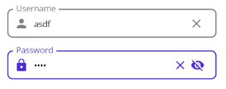
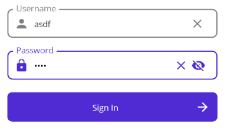

# Extended MAUI Controls

Unlock the true potential of .NET MAUI development with ExtendedMauiControls, a powerful toolkit designed to extend simple controls and effortlessly create sophisticated, custom UI elements.

Built exclusively for .NET MAUI, our library seamlessly integrates with the cross-platform framework, enabling you to enhance your app's UI on iOS, Android, and Windows with a unified codebase.

Μετά απο λαϊκή απαίτηση, αφαιρέθηκε το Placeholder text από το ExtendedEntry Control. Τι α κανς...

# Available Extented Controls
## ExtendedEntry



#### Bindable Properties:
   - Text
#### Properties:
   - Placeholder
   - IsPassword
   - HasClearButton (default: True)
   - PrefixIcon
   - SuffixIcon
   - PrimaryColor
   - UnfocusedColor (default: Gray)
   - TextColor (default: Black)


If you find the entry border in windows to be annoying, like I do, you can simply add the following code in your App.xaml file in your project's Platforms/Windows.

```xml
<maui:MauiWinUIApplication.Resources>
    <Thickness x:Key="TextControlBorderThemeThicknessFocused">0</Thickness>
</maui:MauiWinUIApplication.Resources>
```

This is a temporary solution until I find a nicer way to fix it for everyone!


## ExtendedButton


#### Event Handlers:
   - Tapped
#### Bindable Properties:
   - TappedCommand
#### Properties:
   - Text
   - HorizontalTextAlignment (default: Center)
   - VerticalTextAlignment (default: Center)
   - PrefixIcon
   - SuffixIcon
   - PrimaryColor
   - TextColor (default: White)
   - IconColor (default: White)


# Getting Started

First, in order to use ExtendedMauiControls you need to call in yout project's MauiProgram.cs the extension method of the dependent package CommunityToolkit.Maui and then call the extension method that initializes our toolkit.

```csharp
public static MauiApp CreateMauiApp()
{
    var builder = MauiApp.CreateBuilder();

    // Initialize .NET MAUI Community Toolkit
    builder.UseMauiApp<App>().UseMauiCommunityToolkit();
    
    // Initialize Extended .NET MAUI Controls Toolkit
    builder.UseMauiApp<App>().UseExtendedMauiControls();
}
```


# Usage

You can use the namespace below to use the tookit in xaml or C#

XAML

```xml
xmlns:emc="clr-namespace:ExtendedMauiControls.Controls;assembly=ExtendedMauiControls"
```

C#
```csharp
using MauiExtendedControls.Controls;
```


### Improtant Notes

PrimaryColor is binded to the Primary value in your project's Colors.xaml, so if it is missing you need to add it as shown below:

```xml
<ResourceDictionary 
    xmlns="http://schemas.microsoft.com/dotnet/2021/maui"
    xmlns:x="http://schemas.microsoft.com/winfx/2009/xaml">

    <Color x:Key="Primary">#512BD4</Color>
</ResourceDictionary>
```

In order to use different colors, you can simply override this value by using the PrimaryColor property.


# Examples

Below you can see a simple usage example on a sign-in view

```xml
<emc:ExtendedEntry Text="{Binding Username}"
                   Placeholder="Username"
                   PrefixIcon="Person"/>

<emc:ExtendedEntry Text="{Binding Password}" IsPassword="True"
                   Placeholder="Password"
                   PrefixIcon="Lock"/>

<emc:ExtendedButton Text="Sign In"
                    SuffixIcon="ArrowForward"
                    TappedCommand="{Binding TappedCommand}"/>
```




# Credits

Huge thanks to
[AathifMahir](https://github.com/AathifMahir) for his incredible work on creating MAUI Icons and making it easier to use Material Icons and many more in .NET MAUI.